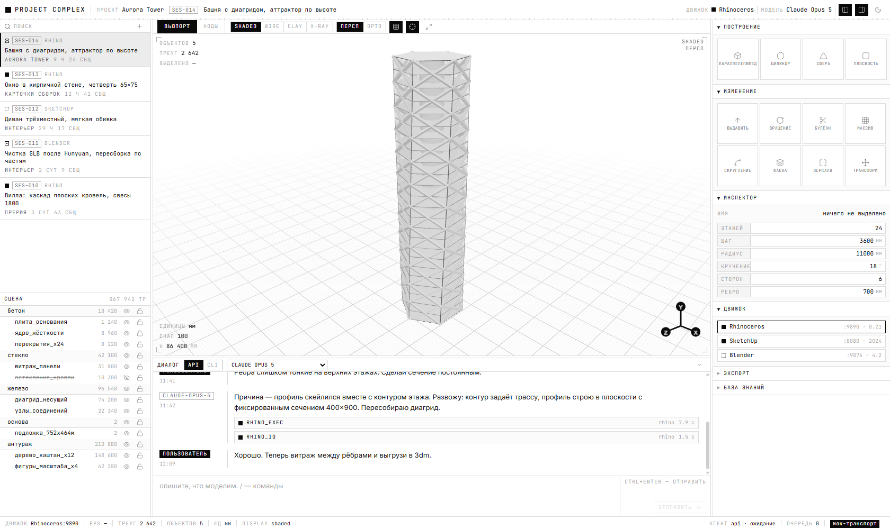

# PROJECT COMPLEX

Комплексный сервис для **vibemodelling**: пользователь моделит промптами и
картинками через веб-морду, под капотом отрабатывают **SketchUp / Blender /
Rhinoceros**, на выходе — качественная геометрия в нужном формате
(`fbx`, `skp`, `3dm`, `obj`, `glb`, `stl`, `step`).

> Этап 1 — веб-морда. Данные пока отдаёт мок-транспорт с теми же сигнатурами,
> что будут у реального gateway.



## Запуск

```bash
npm install
npm run dev
```

Приложение поднимется на `http://localhost:5273`.

```bash
npm run typecheck   # проверка типов по всем воркспейсам
npm run build       # прод-сборка
```

Требуется Node ≥ 20.19.

## Что уже работает

- **Вьюпорт** — живая сцена на three.js: бесконечный грид, вью-куб,
  орбитальная камера, режимы `shaded / wire / clay / x-ray`, перспектива ⇄ орто,
  drag&drop файлов `glb / gltf / obj / stl` прямо в холст.
- **Нодовый редактор** — рабочий граф на React Flow: типы узлов под домен
  (промпт, база знаний, агент, движки, операции, проверка дисциплины, экспорт),
  типизированные порты, палитра по `Tab`.
- **Чат** — стриминг ответа, блоки инструментальных вызовов с кодом и
  результатом, переключатель `API ⇄ CLI` и выбор модели.
- **Сессии и сцена** — список сессий с поиском, аутлайнер со слоями по материалу.
- **Панель инструментов** — построение и изменение, инспектор с драг-скрабом
  (правит демо-модель прямо во вьюпорте), состояние движков, экспорт, база знаний.

## Структура

```
apps/web/            веб-морда (Vite + React + TypeScript)
packages/protocol/   общие типы = контракт с будущим gateway
docs/                архитектура, дизайн-язык, дорожная карта
```

| Документ | О чём |
|---|---|
| [docs/ARCHITECTURE.md](docs/ARCHITECTURE.md) | MCP-мосты движков, MCP базы знаний, мозговой центр, подключение нейросетей по API и через CLI |
| [docs/DESIGN.md](docs/DESIGN.md) | дизайн-язык technical UI / FUI: токены, формы, состояния |
| [docs/ROADMAP.md](docs/ROADMAP.md) | этапы 2…6 |
| [CLAUDE.md](CLAUDE.md) | правила работы с кодовой базой |

## Лицензия

[MIT](LICENSE).

Алгоритмы булевых операций, фасок и скруглений в мосте SketchUp перенесены из
[`zinin/sketchup-mcp2`](https://github.com/zinin/sketchup-mcp2) — спасибо автору
не столько за код, сколько за комментарии: в них зафиксированы обойдённые
ловушки SketchUp, вроде обратной семантики `Group#subtract`, которые иначе
пришлось бы находить заново и дорого. Уведомление об авторстве — в [LICENSE](LICENSE).

## Дизайн

Technical UI / FUI: белый фон, чёрный текст, ноль скруглений и теней, всё на
хайрлайнах, угловых засечках и типографике. **JetBrains Mono** — служебка,
числа, код; **Inter** — тело сообщений. Шрифты локальные, кириллица полная.

Цвета живут только в `apps/web/src/styles/tokens.css`; тёмная тема
переключается атрибутом `data-theme` и уже работает.
